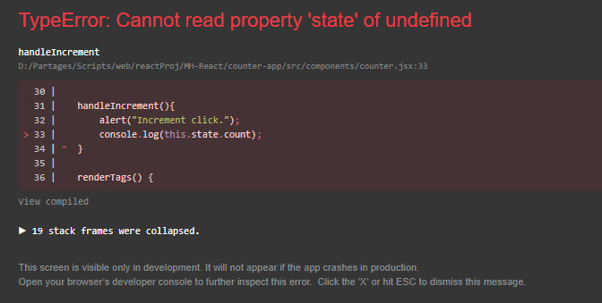
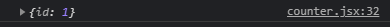
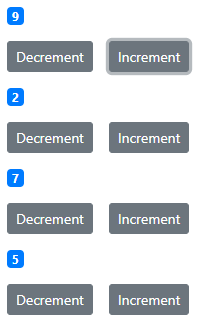
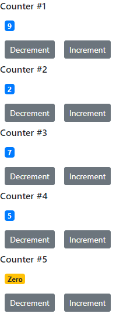
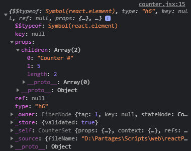
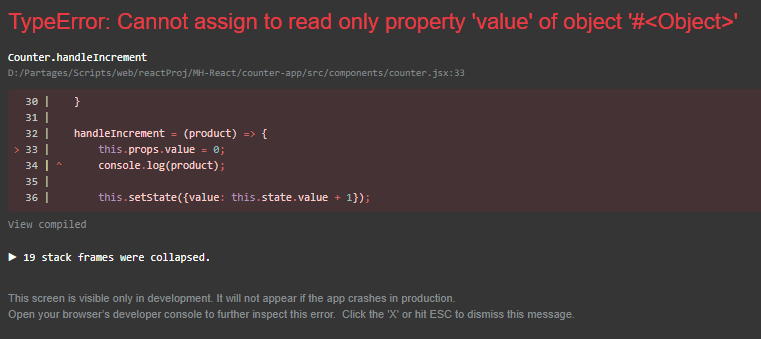
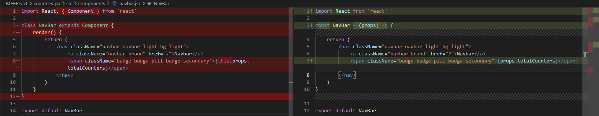

Create-App project
==================

This project will have Bootstrap 4.1.1 as dependency

`npm install --save bootstrap@4.1.1`

In `index.js` we add a line to import the library.

`import 'bootstrap/dist/css/bootstrap.css';`

> Table of Content  
> [Components](#components)  
> [Rendering Code](#rendering-code)
> [Embedding Expression](#embedding-expression)  
> [Setting Attributes](#setting-attributes)  
> [Rendering classes dynamically](#rendering-classes-dynamically)  
> [Rendering lists](#rendering-lists)  
> [Conditional Rendering](#conditional-rendering)  
> [Events](#events)  
> [Composing components](#composing-components)  
> [Debugging React Apps](#debugging-react-apps)  
> [State vs Props](#state-vs-props)  
> [Raising and Handling Events](#raising-and-handling-events)  
> [Single Source of Truth](#single-source-of-truth)    
> [Multiple components in sync](#multiple-components-in-sync)    
> [Stateless Functional Components](#stateless-functional-components)    
> [](#)    

## Components

Components are placed in a `src/components` subfolder by convention. Components may be written in `.js` files but using `.jsx` file extension is advised for it allows the IDE to provide a more complete API.

We create a first `Counter` component with the `rce` snippet from the extension we have installed.

In `index.js` we import our newly created component.

 `import Counter from './components/counter';`

[Back to top](#create-app-project)

 ## Rendering code

 The code to UI rendition in placed into a `render()` method unto the component. This method has a `return` statement that can either be a one liner followed by JSX code, or a multiline JSX code which needs to be put into braces.


> Different possible syntaxes for the return statement
 ```javascript
 // render as one liner
 render() { return <p>A one liner with simple JSX code is fine.</p>; } 

 // render as multiple lines
 render(){

     return(
         <div>
            <p>Or multiple lines.</p>
         </div>
    );
}
 ```

One important note is you can't une the non braced syntax on several lines. If you do so, the `return` statement will be replaced by `return ;`. Indeed there is an *automatic semi-colon insertion* process in JavaScript that adds semi-colons when they are not present. Should a `return` statement be alone on a line, a semicolon will be inserted and the JSX code on the next line will be ignored and cause errors. To avoid this, we add parentheses around the code.

The render method actually translate to a call to `React.createElement()` which takes as the 1st parameter the element to be added. Therefore this element is unique and this is why the `render()` method into a React component must have a unique element. Because of that it is common practice to wrap the code to be rendered into a `<div>` tag.

 When we see the source of the HTML file in the browser, this `<div>` will obviously be present.

> Code generated when wrapping into a classical `<div>` tag.
 ```html
 <div id="root">
    <div>
        <h1>Hello World!</h1>
    </div>
 </div>
 ```

 We can prevent that by wrapping the code into a special tag being `<React.Framgent>` that will not reflect in the HTML code.

> Code generated when wrappin into the specialised `<React.Fragment>` tag.
 ```html
 <div id="root">
    <h1>Hello World!</h1>
 </div>
 ```

 ## Embedding Expression

 We want to make our `Counter` component modular so that the `<h1>` tag has customizable text.

 We will use the `state` object to hold relevant data.

 ```javascript
 state  = {
    count: 0
}
 ```

 We can put expressions in JSX code by putting them in curly braces. Any valid JavaScript code is valid inside these.

 To display the value of the count from state, the following line is OK:
 ```javascript
 <span>{this.state.count}</span><br/>
 ```

 We want to implement a business rule that say if the count value is 0 it will display as text.
 ```js
 <span>{this.state.count === 0 ? 'Zero': this.state.count}</span>
 ```

 With *object deconstruction* we can simplify the access to the count variable from the state, like this

 ```js
 const count = this.state.count;
 const {count} = this.state; // equivalent to the above.
 ```
[Back to top](#create-app-project)

 ## Setting Attributes

 To apply a CSS class to HTML code, we cannot simply use `class` int he JSX code for it is a reserved word of JS. Therefore we must use `className` attribute instead.

 To apply CSS styles inline, we can use the `style` attribute that takes a plain JS object.
 The syntax into that object is to name CSS properties in camel case:


 ```js
 styles = {
     fontSize = 10,
     fontWeight = 'bold'
 }
 ```
 
 You can either provide a prepared object just as the styles object above, or write it inline directly.
 In the second approach it would look like this:

 ```js
 <span style={{fontSize:12, fontWeight:'bold'}} className="badge badge-primary m-2">{this.formatCount()}</span>
 ```

[Back to top](#create-app-project)

## Rendering classes dynamically

We want to make the badge for the counter apply `badge-warning` Bootstrap class is the value is 0 or `badge-primary` otherwise.

In the `render()` method, we could define an inner variable that hold the string with classes to be applied. Some more code to adapt to the expected rule mentioned above. Then pass that variable into braces.

We can also refactor this code so that it ends up becoming a method providing those classes. Then no need to extra variables in the `render()` method.

```js
getBadgeClasses() {
        let classes = "badge m-2 badge-";
        classes += this.state.count === 0 ? "warning" : "primary";
        return classes;
    }

    // In the render() method where relevant ...
    <span className={this.getBadgeClasses()}> // ...
```

[Back to top](#create-app-project)

## Rendering lists

There is no convenient syntax to render lists in React so far. For that job we use the JS `map()` method. The syntax inside the map is similar to a classical `foreach` loop.

```js
state  = {
    count: 0,
    tags: ['tag1','tag2','tag3']
}

// In the render() method where relevant.
// ...
<ul>
    {this.state.tags.map(tag => <li key={tag}>{tag}</li>)}
</ul>
```

[Back to top](#create-app-project)

## Conditional rendering

We want to follow a new rule to display a message when there is no element in the `tags` array, or the array otherwise.

JSX has no `if` or `else` kind statements unlike Angular ofr instance. So we can write our code in a separate function which has these `if`/`else` statements.

```js
render() {
    return (
        <React.Fragment>
            <span className={this.getBadgeClasses()}>{this.formatCount()}</span><br/>
            <button className="btn btn-secondary btn-sm m-2">Increment</button>
            {this.renderTags()}
        </React.Fragment>
    );
}

renderTags() {
    if (this.state.tags.length === 0) return <p className="m-2">There is no tag to display.</p>;

    return (
        <ul className="m-2">
            {this.state.tags.map(tag => <li key={tag}>{tag}</li>)}
        </ul>
    )
}
```

Another method is by using the `&&` operator. Javascript allows to apply such operator for values that are not booleans.
In such case JS tries to convert those non-boolean type to either *truthy* or *falsy*. The result is the last operand.

A string is truthy if not empty. Falsy otherwise.
A number that has a value of 0 is falsy. Truthy otherwise.

In short, everything is truthy unless they are of one of these:
- false
- 0
- ""
- null
- undefined
- NaN

Though there is no `if`/`else` available in JSX, we can still check a single condition. So using the principle above, we can follow the condition with `&&` operator to get what is following as a result.

[Back to top](#create-app-project)

## Events

> There will be further notes on events later in the [Raising and Handling Events](#raising-and-handling-events) section.

React has events handling attributes that follows the format `onEventName`. Their value is an expression. The best way to do it is using an event handling method.

A few common events:

| Attribute| Description |
|-|-|
| onClick | Click event |
| onKeyPress | Key press |
| onChange | When an element has its state changed. Example: Input field text has changed. |
| onFocus | When an element receive focus. Example: Input field get clicked. |
| onBlur | When an element loses focus. Example: Clicking outside of the input field that had focus. |

> Sample from the Counter component
```js
// In the render method
<button onClick={this.handleIncrement} className="btn btn-secondary btn-sm m-2">Increment</button>

// In the Counter component class
handleIncrement(){
    alert("Increment click.");
}
```

### Binding event handlers

We cannot access the state directly from an event handler. For instance, our `handleIncrement()` method would send an error should we try to log the count value from the state to the console.



Indeed `this` returns `unefined`.

In JavaScript, `this` behaves differently than other languages.
Depending on how a function is called `this` can reference different objects.
- If called as part of a method of an object, this will reference that object.
- If called as a standalone function, this will reference the Window object by default. If the strict mode is enabled, the return value is `undefined`.

A solution to solve this issue is to bind the current object to the method. This needs to be done in the constructor of the class.

```js
constructor(){
    super();
    this.handleIncrement = this.handleIncrement.bind(this);
}
```

Though this method is simple, it can become noisy for it demands the use of a `constructor()` in which every method that needs it would be bound as shown above.

Another solution is to use an *arrow function*. These functions do not rebind the `this` keyword. Instead they inherit it.

### Updating the state

We could update the value of our counter because we are basically writing JS code.

```js
handleIncrement = () => {
    this.state.count++
    console.log(this.state.count);
}
```
The above code will work because we are just logging the counter to the console. But on React side, the value change in the state will not be monitored, the change will not be detected and therefore the view will remain static.

React `Component` type provides us with the `setState()` method. This method tells React we are updating the state. Then React will figure ou what part of the state has changed and will synchronise the change from the Virtual DOM with the actual DOM. So in React we have to use `setState()`. It takes an object that either merge (if we provide a new variable) or updates (if we change the value of an existing variable) the state.

Another important thing to note is `setState()` is asynchronous. Which means the operation does not necessarily ends along with the instruction.

> `setState()` is asynchronous
```js
handleIncrement = () => {
    this.setState({count: this.state.count + 1}, () => {
        console.log("Callback setState: "+this.state.count);
    });
    console.log("After setState: "+this.state.count);
}
```

<br/>

> Output of the above


As we can see, the call to `console.log()` that happens after `setState()` displays before the one in the callback method. The former displays the old value, while the later displays the expected value. 

### Passing event arguments

We learned that event attributes expect a function reference (i.e. not a call. In other words not `myFunction()` but `myFunction` and it cannot provide parameters).

One method to work around that is to wrap the parameterised call to the function into  another function.


```js
handleIncrement = (myParam) => {
    console.log(myParam);

    this.setState({count: this.state.count + 1});
}

doHandleIncrement = () => {
    this.handleIncrement({id: 1});
}

// In render method we use our wrapper function doHandleIncrement instead of the wrapped function reference.
<button onClick={this.doHandleIncrement} className="btn btn-secondary btn-sm m-2">Increment</button>
```

Though it might work, this is a tedious and noisy way to work on this matter. A better solution is to use an inline function instead. For the sake of explanation the parameter will be hardcoded.

> In the render method
```js
<button onClick={() => {this.handleIncrement({id:1})}} className="btn btn-secondary btn-sm m-2">Increment</button>
```

> Output



[Back to top](#create-app-project)

## Composing components

So far we've been working on a single component. But React pages are hierarchies of composed components. In other words, components can make use of other components even multiple times. We create a new Component `CounterSet` to wrap a few of the previously made `Counter` component.

```js
import React, { Component } from 'react';
import Counter from './counter';

class CounterSet extends Component {
    render() {
        return (
            <div>
                <Counter />
                <Counter />
                <Counter />
                <Counter />
            </div>
        )
    }
}

export default CounterSet
```

<br/>

> The output in the browser



A better method is to use a collection that holds relevant data about our components. Then use a loop over that collection to create and initialize each of them.

```js
class CounterSet extends Component {

    state = {
        counters: [
            {id:1, value:9},
            {id:2, value:2},
            {id:3, value:7},
            {id:4, value:5},
            {id:5, value:0}
        ]
    }

    render() {
        return (
            <div>
                {this.state.counters.map(counter => <Counter key={counter.id} value={counter.value}/>)}  
            </div>
        )
    }
}
```

This way, it is easy to maintain the paramaters to pass to a component.
Passing data to a component is done via freely named attributes. 

The name of the attribute is then part of the properties of the component which is a JavaScript object called `props`. This object will in its turn have a named value reflecting the name of the attribute that has been passed. The default value passed is `true`;

In the loop from the above code, we add `value={counter.value}` inside the `Counter` tag. This will result in that `Counter` object having a `value` property initialized with the value taken from the `counters` collection set earlier.

> counter.jsx
```js
state  = {
    value: this.props.value
}

// ...

formatCount() {
    const {value} = this.state;
    return value === 0 ? 'Zero': value;
}
```

From the `Counter` component, this will allow us to initialize the given value in the `state`.

There is also a special property to `props` called `children` that is handy to pass UI code. Instead of using the component in a self-closing fashion, we use it as an opening/closing pair. So instead of `<Counter />`, we use `<Counter></Counter>`. What is between these tags will be put into that `children` property.

> From the render method of counterSet.jsx
```javascript
<div>
    {this.state.counters.map(counter => 
    <Counter key={counter.id} value={counter.value}>
        <h6>Counter #{counter.id}</h6>
    </Counter>)}
</div>
```

Inside the component tags, we add some markup. Notice it is an `<h6>` header tag. We provide the `counter.id` value.

> From the render method of counter.jsx
```javascript
<React.Fragment>
    {this.props.children}
    // ... Anything then ...
</React.Fragment>
```

On the `props.children` receiving component, we can simply include that `children` property. 

```js
{this.props.children}
```

> Result in the browser



In the browser, our counter are now given those respective headings.

> Sample from the output in the console



In the console we get a React element which type is `h6`. We also see that `props` has a `children` array of 2 elements being the text provided along with the `counter.id` value it got passed.

We can get the same result by just passing the `id` to our component and have it use it to internally render the heading.

[Back to top](#create-app-project)

## Debugging React Apps

A useful tool to debug React application is an extension Facebook that exists for Firefox and Chrome. It will basically allow to view the component hierarchy along with some internals such as `state` and `props`.

It has a filtering functionality especially handy in complex applications.

Selecting an element from that hierarchy sets a javascript `$r` variable which makes it possible to interact from the console.

Similarly the native Element tab from the developer tools displays the DOM. Selecting a node set a `$0` variable that also allows interaction from the console.

[Back to top](#create-app-project)

## State vs Props

Props is data we provide a component. Props are read only. Once set, we cannot change the value from within the component.



State is data local and private to a component.

Custom attributes can be set when using a component. They become part of the props of that used component.

[Back to top](#create-app-project)

## Raising and Handling Events

> See also notes on [Events](#events).

To explain event handling in React we will add a delete button on each counter. This button will be part of the `counter.jsx` file. When this button is clicked, the corresponding counter shall be removed from the list of counter. That list is maintained by the `counterSet.jsx`.

> Rule of thumb: The component that owns a part of the state should be the one modifying it.

The above rule of thumb means that in out current context, when clicking on the delete button which is part of the `counter.jsx` we have to make the `counterSet.jsx` perform the actual action. 

> counter.jsx
```html
<button className="btn btn-danger btn-sm m-2">Delete</button>
```

We define a button in the `counter.jsx` file.

> counterSet.jsx
```js
render() {
    return (
        <div>
            {this.state.counters.map(counter => 
            <Counter
                key={counter.id} 
                value={counter.value} 
                id={counter.id}
                onDelete={this.handleDelete}
            />)}
        </div>
    )
}

handleDelete = () => {console.log("HANDLE DELETE CLICKED.");}
```

We add an event handler method `handleDelete` in our `counterSet.jsx` file.
In the loop that create `<Counter>` elements, we add an `onDelete` attribute to which we pass a reference to the above mentioned event handler.

> counter.jsx
```html
<button onClick={this.props.onDelete} className="btn btn-danger btn-sm m-2">Delete</button>
```

Finally we update our button in `counter.jsx` with our `onDelete` props. When the delete button on a counter will be clicked, that method will be called.

### Updating the state

We cannot update the state directly. So what we do is create a new counters table and use `setState()` to update it.

```js
handleDelete = (counterId) => {
    const counters = this.state.counters.filter(c => c.id !== counterId);
    this.setState({counters : counters}); // or this.setState({counters});
}
```

### Why passing the `key` when `id` shares the same value?

In `counterSet.jsx`, we pass several `props` through custom attributes. As we maintain the code, we may need more of these and the code become difficult to maintain and noisy.

The solution is to simply pass the props in one go.

This results in cleaner and more maintainable `props`.

In the `counter.jsx` file we need to update our reference.

For instance:
```js
value: this.props.value
```

becomes

```js
value: this.props.counter.value
```

[Back to top](#create-app-project)

## Single source of Truth.

To explain that concept, we will implement a Reset button that shall set the values of each counter to 0.

So in the `counterSet.jsx` we we create a button and the relevant method to reset the values.

```js
handleReset = () => {
    const counters = this.state.counters.map( c => {
        c.value = 0;
        return c;
    });

    this.setState({counters});
}

// In the render() method.
<button onClick={this.handleReset} className="btn btn-primary btn-sm m-2">Reset</button>
```

Using the React Developer Tools plugin, we can see the state in the `<CounterSet>` component as well as the props in the `<Counter>` components, the value has been updated to 0. The state of the `<Counter>` components remains unchanged though. So the state in the child component is disconnected from the state in its parent. This leads the view to not reflect any change.

### Removing the local state

We need to make our `<Counter>` component a **controlled component**. It means that the component receives its data from its parent and raises events to the parent when data needs to be changed.

In the `<Counter>` component, we remove or update any reference to state that is related to anything that needs to come from the parent component.

For instance, the `formatCount()` method invokes a `value` that is no more available from the `state` but the `props`. This will be updated accordingly:

```js
formatCount() {
    const {value} = this.props.counter;
    return value === 0 ? 'Zero': value;
}
```

The event handlers are no more part of the `<Counter>` component but passed via the `props`, which means we do not need anymore any internal event handling functions. There are removed.

> counter.jsx
```html
<button onClick={this.props.onDecrement} className="btn btn-secondary btn-sm m-2">Decrement</button>
<button onClick={this.props.onIncrement} className="btn btn-secondary btn-sm m-2">Increment</button>
```

In the `<CounterSet>` component, we provide new event handlers that get passed to the children components.

> counterSet.jsx
```js
render() {
    return (
        <div>
            <button onClick={this.handleReset} className="btn btn-primary btn-sm m-2">Reset</button>
            {this.state.counters.map(counter => 
            <Counter
                key={counter.id} 
                counter={counter}
                onDelete={this.handleDelete}
                onIncrement={() => {this.handleIncrement(counter)}}
                onDecrement={() => {this.handleDecrement(counter)}}
            />)}
        </div>
    )
}
```

Just like for the `handleDelete()` event handler that uses `onDelete` custom attribute, we will use the same principle with the increment and decrement operations.

> counterSet.jsx
```js
handleIncrement = counter => {
    const counters = [...this.state.counters];
    const index = counters.indexOf(counter);
    counters[index] = {...counter};
    counters[index].value++;
    this.setState({counters});
}

```

The basic idea is to make a copy of the `counters` array from the state. We then find the corresponding `index` of the `counter` passed as an argument. Because the array copy actually seems to pass a reference to the array, any modification is made directly to the `state`, which is not a good practice in React. We therefore decouple our line by updating the relevant index with our `counter` and work on its value. Finally the state is updated as usual.

[Back to top](#create-app-project)

## Multiple components in sync

We want to add a navigation bar that would display the number of counters displayed in the `<CounterSet>` component. This means we need to create a new component for that matter. But also we would need to exchange data between these components. We however do not share any parent/child relationship. therefore we cannot exchange data via the `props`.

To solve that problem, we need to have a single common parent to those 2 components. We then make them both children of the `<App>` component. This will allow us to follow a rule that occurs when several components need to share data.

> Lift the state up.

To do that, we need to more the state and the functions that act on it to the parent component.
So the `counters` array along with `handleIncrement()`, `handleDecrement()` or `handleReset()` must be moved to `<App>` component.

Should we have a component hierarchy with a few components between the one on top holding the common state, and the one that actually needs it, we just pass state via props and reference for functions. Should a method need parameters, only in the component that actually use it, do we provide them using an arrow function notation. Then the call is bubbling up the hierarchy until it reaches the component having the code.

The result is multiple components in sync.

[Back to top](#create-app-project)

## Stateless Functional Components

Only render method
No event handler
No helper method
No state
Date comes from props

In such situation the component can be converted to a **Stateless Functional Component**. In other words we change the component from being a class to becoming a function. Which of a class of function to use is a matter of personal preference.

> NavBar as a class component
```js
import React, { Component } from 'react'

class NavBar extends Component {
    render() {
        return (
            <nav className="navbar navbar-light bg-light">
                <a className="navbar-brand" href="#">Navbar</a>
                <span className="badge badge-pill badge-secondary">{this.props.totalCounters}</span>
            </nav>
        )
    }
}

export default NavBar
```

Also `props` are part of classes. We need to make props a parameter of the function and the `this` keyword to be removed. React will pass the props as an argument to the function at runtime.

> NavBar as a stateless functional component
```js
import React from 'react'

const NavBar = (props) => {
    return (
        <nav className="navbar navbar-light bg-light">
            <a className="navbar-brand" href="#">Navbar</a>
            <span className="badge badge-pill badge-secondary">{props.totalCounters}</span>
        </nav>
    )
}

export default NavBar
```

The screenshot bellow shows the diff between the former class component approach, and the stateless functional component one.

> Diff from VS Code showing what has changed between the 2 approaches.



[Back to top](#create-app-project)